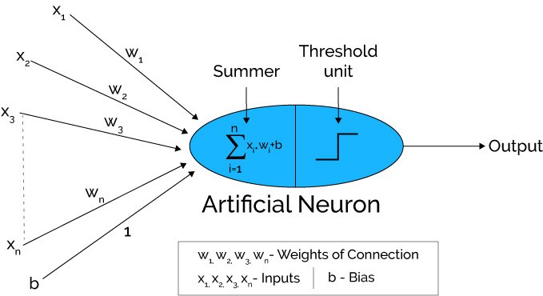
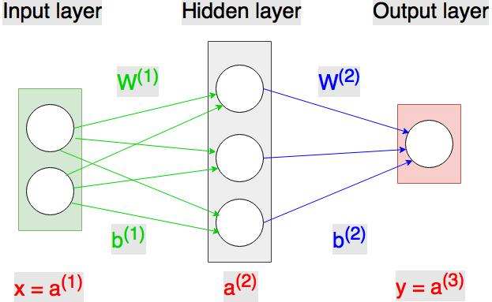
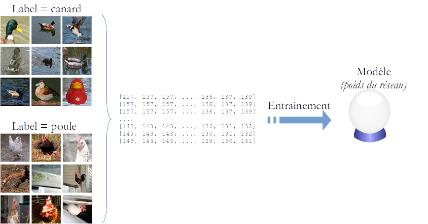

# La problématique

<div class="gray">
> - IoT
> - Cloud
> - Performance
> - Énergie
</div>

## {data-background=slides/air-aircraft-clouds-219701.jpg data-background-size=cover}

## {data-background=slides/object-detection-recognition-and-tracking-fig00.jpg data-background-size=cover}

## {data-background=slides/2017-05-03-segmentation11-large.png data-background-size=cover}

## {data-background=slides/Neurons-by-Penn-State.jpg data-background-size=cover}

<div class="notes">

- reconnaissance d'images
- réseaux de neurones

- modèles complexes, l'inférence peut être gourmande en ressources physique (mem + cpu)
- souvent on aimerait que l'inférence soit faite au plus proche du capteur => embarqué
- embarqué => perf => énergie
- réduire les échanges réseaux (avec le cloud)
</div>

# Récap' {data-background=slides/blur-figurine-landscape-1084751.jpg data-background-size=cover}


## Les bases {.smaller}

1957: Création du _Perceptron_ par Frank Rosenblatt

```{r,Perceptron,out.width='30%', fig.align='center', echo=FALSE}

```

* **Input**: $(x_1, x_2, ..., x_n)$ un vecteur de dimension $n$
* **Weights:** $(w_1, w_2, ..., w_n)$ un vecteur de dimension $n$
* **Bias:** $b$, un scalaire
* **Output:**

$y = \begin{cases}
1,  & \text{if $\sum_{i=1}^n x_i.w_i + b > $ seuil} \\
0, & {otherwise}
\end{cases}$

## {data-background=slides/neuralnetworks.png data-background-size=contain}

## Entrainement {.build}

```{r,MLP_training,out.width='300px', fig.align='center', echo=FALSE}

```

```{r,MLP_training_with_dataset,out.width='600px', fig.align='center', echo=FALSE}

```


## Inférence

```{r,MLP_forward_propagation,out.width='300px', fig.align='center', echo=FALSE}

```

* $x$ vecteur représentant une observation, $f$ fonction d'activation
* $a^{(1)} = x$
* $z^{(2)} = a^{(1)}.W^{(1)} + b^{(1)} = x.W^{(1)} + b^{(1)}$
* $a^{(2)} = f(z^{(2)})$
* $z^{(3)} = a^{(2)}.W^{(2)} + b^{(2)}$
* $y = a^{(3)} = f(z^{(3)})$

# GPU {data-background=slides/gpus.png data-background-size=contain}


# Edge Computing

<div class="gray">
> L'edge computing est une méthode d'optimisation employée dans le cloud computing qui consiste à traiter les données à la périphérie du réseau, près de la source des données -- Wikipedia
</div>

# VPU {.build}

<div class="gray">
- dédié
- moins de fonctionnalités
- moins énergivore
</div>

## {data-background="slides/Screenshot_2018-10-24 Intel® Movidius™ Neural Compute Stick.png" data-background-size=contain}

<div class="notes">
Movidius was co-founded in Dublin in 2005 by Sean Mitchell and David Moloney.[1][2] Between 2006 and 2016, it raised nearly $90 million in capital funding.[3] In May, 2013 the company appointed Remi El-Ouazzane as CEO.[4] In January, 2016 the company announced a partnership with Google.[5] Movidius has been active in the Google Project Tango project.[6] Movidius announced a planned acquisition by Intel in September 2016.[7]

Tensorflow et Caffe
</div>


## {data-background="slides/Screenshot_2018-10-24 Edge TPU Devices.png" data-background-size=contain}

Google AIY

<div class="notes">
MobileNet V2 at 100+ fps

Tensorflow lite
</div>

# Dans le Neural Compute Stick

## {data-background=slides/NCS1_ArchDiagram.jpg data-background-size=cover}

<div class="notes">
- an array of 12 VLIW vector processors called SHAVE processors. These processors are used to accelerate neural networks by running parts of the neural networks in parallel.
- SPARC microprocessor core that runs custom firmware
- A LEON processor coordinates receiving the graph file and images for inference via the USB connection. It also parses the graph file and schedules kernels to the SHAVE neural compute accelerator engines. In addition, the LEON processor also takes care of monitoring die temperature and throttling processing on high temperature alerts
</div>

# 1W vs. 180W {.build}

<div class="gray">
2.5x5cm vs. 10x25cm
</div>

<div class="notes">
- http://juxi.net/workshop/deep-learning-rss-2017/papers/Pena.pdf
- https://www.nvidia.com/fr-fr/geforce/products/10series/geforce-gtx-1080/
</div>

# Démarche {.build}

<div class="gray">
- train ton modèle
- profile/tune/compile ton modèle sur PC
- prototype sur système embarqué
</div>

# Exemple {data-background=slides/adult-ai-artificial-intelligence-1020325.jpg data-background-size=cover class=blue}

# Alphashifumi {data-background=slides/alphashifumi_v1.jpg data-background-size=contain}

## V2 {data-background=slides/alphashifumi_v2.jpg data-background-size=contain}

## V2 {data-background=slides/archi_alphashifumi.png data-background-size=contain}

## V800 {data-background=slides/T800.jpg data-background-size=contain}

## L'IA dans Alphashifumi {.build}

```{r,image_sample_1,out.width='10%', fig.align='center', echo=FALSE}
knitr::include_graphics("data/alphashifumi/test/paper/26475c05-9d1e-11e7-abeb-b1233b68540d-1.jpg")
```

```{r,arrow_down,out.width='10%', fig.align='center', echo=FALSE}

```

```{r,expected_result,out.width='10%', fig.align='center', fig.cap='PAPER', echo=FALSE}

```


# Entrainement du modèle

```{r,set_virtualenv,results='hide',message=FALSE,echo=FALSE}
library(reticulate)
use_virtualenv('~/.virtualenvs/r-tensorflow-py3', required = TRUE)
```
## Chargement des librairies

```{r,load_libraries,results='hide',message=FALSE}
library(keras)
library(tensorflow)
```

```{r,settings,results='hide',message=FALSE,echo=FALSE}
img_width <- 128
img_height <- 128
train_data_dir <-  "/home/geraud/data/alphashifumi/train"
validation_data_dir <-  "/home/geraud/data/alphashifumi/test"
nb_classes <- 5
nb_train_samples <- 1300 
nb_validation_samples <- 300
batch_size <- 64
epochs <- 50
model_output_dir <- './target/models/'
augmented_data <- './target/generated/'

if (!dir.exists(model_output_dir)) dir.create(model_output_dir, recursive = TRUE)
if (!dir.exists(augmented_data)) dir.create(augmented_data, recursive = TRUE)
```

## Modèle simple

```{r,simple_model,collapse=TRUE}
model <- keras_model_sequential()
model %>%
    layer_flatten(input_shape = c(128, 128, 1)) %>%
    layer_dense(units = 1024, activation = 'relu') %>%
    layer_dense(units = 1024, activation = 'relu') %>%
    layer_dense(units = 5, activation = 'softmax', name = 'output')
```

```{r,summary_simple_model,echo=FALSE}
summary(model)
```

## Compilation

On _compile_ le modèle :

```{r,model_compilation}
model %>% compile(optimizer = 'rmsprop',
                  loss = 'categorical_crossentropy',
                  metrics = c('accuracy'))
```

```{r,datagen,results='hide',echo=FALSE,message=FALSE}
source('prepare_data.R')

generators <- get_generators('grayscale')
train_generator <- generators[[1]]
validation_generator <- generators[[2]]
```

## Entrainement {.build}

```{r,train_model}
history <- model %>% fit_generator(train_generator,
                                   validation_data = validation_generator,
                                   steps_per_epoch = nb_train_samples / batch_size,
                                   validation_steps = nb_validation_samples / batch_size,
                                   epochs = 10)
```

```{r,img_preproc,echo=FALSE}
img_preproc <- function(img) {
    image_load(img, grayscale = TRUE) %>%
        image_to_array %>%
        array_reshape(c(1, img_width, img_height, 1))
}
sample_img <- img_preproc("data/alphashifumi/test/paper/26475c05-9d1e-11e7-abeb-b1233b68540d-1.jpg")
```

```{r,image_sample_2,out.width='10%', fig.align='center', fig.cap='Exemple shifumi', echo=FALSE}
knitr::include_graphics("data/alphashifumi/test/paper/26475c05-9d1e-11e7-abeb-b1233b68540d-1.jpg")
```

```{r,simple_prediction}
predict(model, sample_img)
```


```{r,save_model,echo=FALSE}
save_model_hdf5(model, 'target/models/slide.hdf5')
```

## Performance

```{r,train_history}
plot(history)
```

## Freeze du modèle

```{r,freeze_model}
source('freeze.R')

io_names <- freeze(model)
```

- le _freeze_ permet de préparer le modèle pour l'inférence
  - suppression des couches d'entrainement
  - transformation des variables en constantes
  - modifier la précision (par ex.: float sur 32bit vers 16bit)

# Toolkit

<div class="gray">
- mvNCCheck
- mvNCProfile
- mvNCCompile
</div>

## Compilation

On compile le modèle dans un format pris en charge par le NCS.
Avec :

- `r io_names$input` en entrée
- `r io_names$output` en sortie.
                                       
```{r,set_io_names_env,echo=FALSE}
source('freeze.R')

set_io_names_env(io_names$input, io_names$output)
```

```{r,nscompile_clean_cmd,eval=FALSE}
mvNCCompile target/models/keras_to_tf.pb -o target/ncs/ncs.graph \
	       -in $INPUT_NAME \
 	       -on $OUTPUT_NAME

#$
```
```{bash,ncscompile,results='hide',echo=FALSE}
PYTHONPATH="${PYTHONPATH}:/opt/movidius/caffe/python"
source /opt/movidius/virtualenv-python/bin/activate
mkdir -p $PWD/target/ncs

mvNCCompile target/models/keras_to_tf.pb -o target/ncs/ncs.graph \
	       -in $INPUT_NAME \
 	       -on $OUTPUT_NAME \
         -is 128 128

#mvNCProfile target/models/keras_to_tf.pb \
#	       -in $INPUT_NAME \
# 	       -on $OUTPUT_NAME \
#         -is 128 128

#$
```
## Profiling


```{r,ncsprofile_clean_cmd,eval=FALSE}
mvNCProfile target/models/keras_to_tf.pb \
	       -in $INPUT_NAME \
 	       -on $OUTPUT_NAME

#$
```

[Example de rapport](output_report.html)


# Utilisation du SDK

## Liste des devices

```{r,set_virtualenv_ncs,results='hide',message=FALSE,echo=FALSE}
library(reticulate)
use_virtualenv('/opt/movidius/virtualenv-python', required = TRUE)
```

```{python,device_list}
from mvnc import mvncapi

device_list = mvncapi.enumerate_devices()
print(device_list)
has_device = bool(device_list)
```

Initialisation et ouverture d'un device :

```{python,device_open,eval=py$has_device}
device = mvncapi.Device(device_list[0])
device.open()
```

---

Affichage de quelques options :
```{python,device_options,eval=py$has_device}
print(device.get_option(mvncapi.DeviceOption.RO_DEVICE_NAME))
print(device.get_option(mvncapi.DeviceOption.RO_MEMORY_SIZE))
print(device.get_option(mvncapi.DeviceOption.RO_DEVICE_STATE))
```

## Chargement du graphe

```{python,graph_to_buffer,eval=py$has_device}
GRAPH_FILEPATH = './target/ncs/ncs.graph'
with open(GRAPH_FILEPATH, mode='rb') as f:
    graph_buffer = f.read()
```

On utilise la classe _Graph_ :
```{python,init_graph,eval=py$has_device}
graph = mvncapi.Graph('graph1')
```

Les entrées/sorties du graphe sont gérés par des files. On peut les créer avec les paramètres par défaut :
```{python,init_fifo,eval=py$has_device}
input_fifo, output_fifo = graph.allocate_with_fifos(device, graph_buffer)
```

## Inférons 1/2

On charge une image :

```{r,image_sample,out.width='10%', fig.align='center', fig.cap='Exemple shifumi', echo=FALSE}
knitr::include_graphics("data/alphashifumi/test/paper/26475c05-9d1e-11e7-abeb-b1233b68540d-1.jpg")
```

```{python,first_inference,results='hide',eval=py$has_device}
from scipy import misc
import numpy

tensor = misc.imread('data/alphashifumi/test/paper/26475c05-9d1e-11e7-abeb-b1233b68540d-1.jpg')
tensor = tensor.astype(numpy.float32)
```

```{python,np_zeros,echo=FALSE,results='hide',eval=FALSE}
import numpy as np
tensor = np.zeros([128,128,1], numpy.float32)
```

L'image est ensuite poussée dans la file d'entrée :
```{python,queue_inference,eval=py$has_device}
graph.queue_inference_with_fifo_elem(input_fifo, output_fifo, tensor, 'test paper')
```

## Inférons 2/2

L'image va être lue par le device qui va ensuite procéder à l'inférence. Le résultat est ensuite poussé dans la file de sortie :
```{python,read_inference,eval=py$has_device}
output, user_obj = output_fifo.read_elem()
print(output)
print(user_obj)
```


## Nettoyage

```{python,clean_all_1,eval=py$has_device}
input_fifo.destroy()
output_fifo.destroy()
graph.destroy()
device.close()
device.destroy()
```

# Benchmark

## CPU vs. VPU {.build}

CPU :
```{r,benchmark_r,echo=FALSE,cache=TRUE}
img_dir  <- 'data/alphashifumi/test'
imgs <- lapply(list.files(img_dir, recursive = TRUE), function(filename) {
    img_preproc(paste(img_dir, filename, sep = '/')) %>%
        array_reshape(c(1, img_height, img_width, 3))
})

sapply(imgs, function(img) {
    system.time(predict(model, img))['elapsed']
}) %>% summary(digits = 3)
```

```{python,benchmark_ncs,echo=FALSE,eval=py$has_device}
from mvnc import mvncapi

device_list = mvncapi.enumerate_devices()
device = mvncapi.Device(device_list[0])
device.open()
GRAPH_FILEPATH = './target/ncs/ncs.graph'
with open(GRAPH_FILEPATH, mode='rb') as f:
    graph_buffer = f.read()

graph = mvncapi.Graph('graph1')
input_fifo, output_fifo = graph.allocate_with_fifos(device, graph_buffer)

from scipy import misc
import numpy

import os
import time

tensors = [ misc.imread(os.path.join(dirname, filename)).astype(numpy.float32) for dirname, dirnames, filenames in os.walk('data/alphashifumi/test') for filename in filenames ]
times = []
for tensor in tensors:
    start = time.time()
    graph.queue_inference_with_fifo_elem(input_fifo, output_fifo, tensor, 'test paper')
    output, user_obj = output_fifo.read_elem()
    times.append(time.time() - start)
```

```{python,clean_all_2,echo=FALSE,eval=py$has_device}
input_fifo.destroy()
output_fifo.destroy()
graph.destroy()
device.close()
device.destroy()
```
VPU :
```{r,summary_vpu,echo=FALSE,eval=py$has_device}
summary(py$times, digits = 3)
```

VPU sur RPI :
```{r,summary_vpu_rpi,echo=FALSE}
vpu_rpi_data <- read.csv('results_pi.csv', header = FALSE)
summary(vpu_rpi_data$V1, digits = 3)
```

# Transfer Learning {.build}

```{r,Boromir_transfer_learning,out.width='50%', fig.align='center', echo=FALSE}

```

<div class="notes">
</div>

## Inception {data-background=slides/inception.png data-background-size=contain}

---

```{r,inception_preparation,echo=FALSE}
library(reticulate)
use_virtualenv('~/.virtualenvs/r-tensorflow-py3', required = TRUE)
library(keras)
library(tensorflow)

img_width <- 128
img_height <- 128
train_data_dir <-  "/home/geraud/data/alphashifumi/train"
validation_data_dir <-  "/home/geraud/data/alphashifumi/test"
nb_classes <- 5
nb_train_samples <- 1300 
nb_validation_samples <- 300
batch_size <- 64
epochs <- 50
model_output_dir <- './target/models/'
augmented_data <- './target/generated/'

source('freeze.R')
source('prepare_data.R')

k_clear_session()
k_set_learning_phase(1)
```

```{r,inception_loading}
base_model <- application_inception_v3(weight = 'imagenet',
                                       include_top = FALSE,
                                       input_shape = c(img_width, img_height, 3),
                                       pooling = 'avg')
```

On ajoute nos couches denses :

```{r,custom_layers}
predictions <- base_model$output %>%
    layer_dense(units = 1024, activation = 'relu') %>%
    layer_dense(units = 1024, activation = 'relu') %>%
    layer_dense(units = 512, activation = 'relu') %>%
    layer_dense(units = 5, activation = 'softmax', name = 'output')

```

## On regroupe les morceaux

Le nouveau modèle à entrainer devient :
```{r,keras_model_transfer}
model <- keras_model(inputs = base_model$input, outputs = predictions)
```

On _freeze_ toutes les couches, pas besoin de les réentrainer :

```{r,freeze_layers}
freeze_weights(base_model)
```

## ...

```{r,train_model_transfer,echo=FALSE,eval=FALSE}
generators <- get_generators('rgb')
train_generator <- generators[[1]]
validation_generator <- generators[[2]]

model %>% compile(optimizer = 'rmsprop',
                  loss = 'categorical_crossentropy',
                  metrics = c('accuracy'))

history <- model %>% fit_generator(train_generator,
                                   validation_data = validation_generator,
                                   steps_per_epoch = nb_train_samples / batch_size,
                                   validation_steps = nb_validation_samples / batch_size,
                                   epochs = 10)

plot(history)

io_names <- freeze(model, model_output_file = 'transfer_to_tf')
set_io_names_env(io_names$input, io_names$output)
```

```{bash,ncscompile_model_transfer,echo=FALSE,eval=FALSE}
PYTHONPATH="${PYTHONPATH}:/opt/movidius/caffe/python"
source /opt/movidius/virtualenv-python/bin/activate
mkdir -p $PWD/target/ncs

mvNCCompile target/models/transfer_to_tf.pb -o target/ncs/ncs-transfer.graph \
	       -in $INPUT_NAME \
 	       -on $OUTPUT_NAME \
         -is 128 128 || true
#$

```

## Tout n'est pas perdu {.build}

* Évolution du SDK
* NCAppZoo
* Communauté Movidius

# Conclusion {.build}

<div class="gray">
- Neural Compute Stick
- Inférence de réseaux
- Prototypage
- Performant et peu énergivore
- SDK et API en évolution
</div>

# Merci {.build}

```{r,image_zenika,out.width='20%', fig.align='right', echo=FALSE}

```

<div class="gray smaller">
Géraud Dugé de Bernonville / Consultant Big Data - Zenika Bordeaux

* geraud.dugedebernonville@zenika.com
* @geraudster

</div>

# Liens

- Code source de cette présentation : https://github.com/geraudster/vpu-shifumi-demo
- https://movidius.github.io/ncsdk/
- https://software.intel.com/en-us/ai-academy/students/kits/ai-on-the-edge-vision-movidius
- https://blog.keras.io/building-powerful-image-classification-models-using-very-little-data.html

# Credits

- Neurons-by-Penn-State.jpg (Photo credit: Penn State)
- 2017-05-03-segmentation11-large.png (https://blog.mapillary.com/product/2017/05/03/mapillary-vistas-dataset.html)
- object-detection-recognition-and-tracking-fig00.jpg (https://software.intel.com/en-us/articles/a-closer-look-at-object-detection-recognition-and-tracking)
- neuralnetworks.png (http://www.asimovinstitute.org/neural-network-zoo/)

---

- gpus.png https://blog.slavv.com/picking-a-gpu-for-deep-learning-3d4795c273b9 
